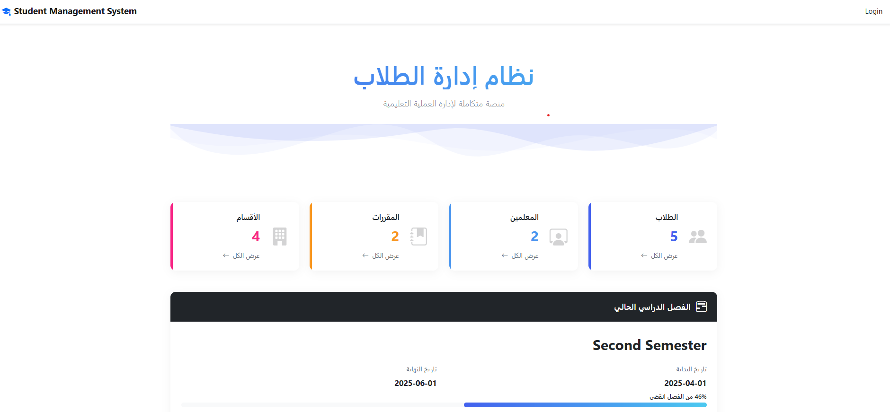
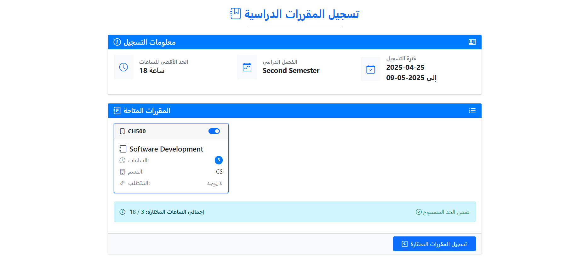
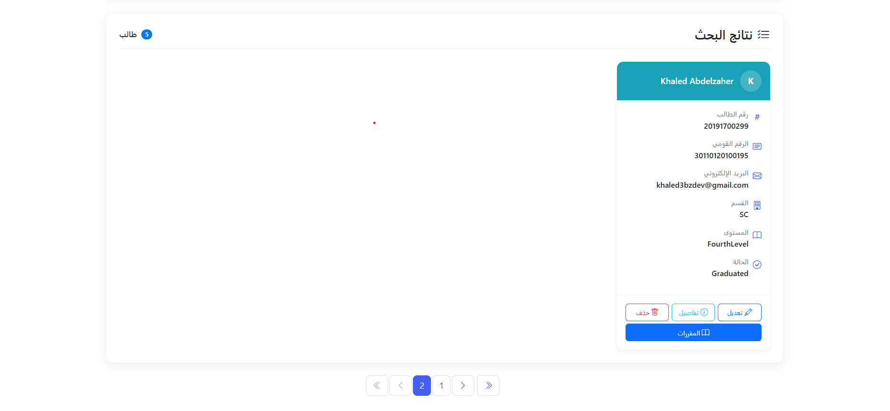

# Student Management System
🚀 **My First .NET Project**

A full-stack web application built with ASP.NET Core MVC (.NET 8) and Entity Framework Core.  
The system provides full control over student enrollment, course management, academic years, semesters, grades, and user authentication with a focus on performance, clean code, and scalability.

Live Demo : http://studentmanagementsystemmvc.runasp.net/

## 📋 Project Description
Student Management System is a web-based platform designed to manage the following:  
- Students, Instructors, Tracks, and Courses  
- Academic years and semesters  
- Student enrollment and course registration  
- Adding and managing student grades  
- Secure user authentication with external login support  
- CRUD operations across all entities  
- Dynamic alert messages with SweetAlert2  

## 🛠️ Technologies Used
- **Backend**: ASP.NET Core MVC (.NET 8), Entity Framework Core  
- **Database**: SQL Server (Code-First Approach)  
- **Authentication**: ASP.NET Core Identity, External Logins  
- **Frontend**: Bootstrap, AJAX, SweetAlert2  
- **Libraries & Tools**: AutoMapper, LINQ, Stored Procedures  
- **Design Patterns**: Unit of Work, Generic Repository  
- **Other Features**: Pagination, Remote Validation, Custom Validation, DTOs, ViewModels, Image Upload  

## ✨ Key Features
- Full CRUD operations for Students, Instructors, Tracks, and Courses.  
- Manage Academic Years and Semesters.  
- Enroll students in courses and manage their grades.  
- Secure Authentication and Authorization with External Logins.  
- Client-side and Server-side validation.  
- Real-time asynchronous operations with AJAX.  
- Attractive and user-friendly alerts with SweetAlert2.  
- Optimized performance with Pagination and Stored Procedures.  

## 🚀 Getting Started
1. Clone the repository:  
   ```bash
   git clone https://github.com/Khaled3bzaher/StudentManagementSystemMVC.git
2. Open the solution in Visual Studio 2022 or later.
1. Update the appsettings.json with your SQL Server connection string.
1. Apply Migrations to create the database:
   ```bash
   Update-Database
1. Run the application and start exploring!

## 📸 Screenshots
Here are some glimpses of the Student Management System in action:


  
  


## 📢 Contact
If you have any questions, feel free to reach out!  
[https://www.linkedin.com/in/khaled3bzaher/]  

## #️⃣ Tags
#ASPNetCore #EntityFrameworkCore #DotNet #MVC #SQLServer #SoftwareEngineering #LINQ #StudentManagementSystem #SweetAlert2
